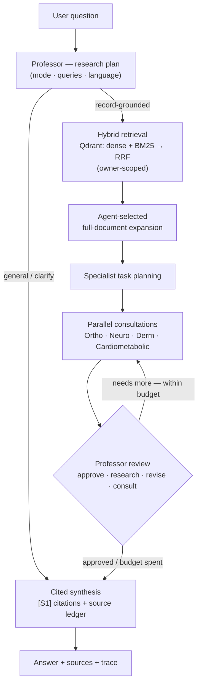

# Medic — Agentic Medical-Document RAG

> A source-grounded medical-documentation assistant. A **Professor** agent plans
> the research, **specialist** agents consult in parallel, a **review loop**
> critiques the result, and every claim is answered with inline citations back to
> the user's own documents.

Python 3.12 · FastAPI · LangChain · Qdrant (hybrid) · PostgreSQL ·
Preact/TypeScript · `mypy --strict`

## What it is

A retrieval-augmented assistant that answers health questions **strictly from a
user's own uploaded PDFs** — never from model memory. It is built as a portfolio
piece to show production-minded agentic RAG: a multi-agent orchestration with
bounded cost, hybrid retrieval, fail-open resilience, verifiable citations, and
automated quality gates.

> Demo project on **synthetic data only**. Not a medical device and not for
> clinical use.

## How it works



1. **Plan** — the Professor classifies the question (`record_grounded`,
   `general_information`, or `clarify`), picks the answer language, and drafts
   retrieval queries.
2. **Retrieve** — hybrid search over Qdrant (dense + BM25 sparse, fused with
   Reciprocal Rank Fusion), filtered to the asking user's documents.
3. **Expand** — the agent decides which retrieved chunks are load-bearing and
   pulls their **full** parsed documents, not just the chunk.
4. **Consult** — relevant specialists run **in parallel**, each producing
   findings, evidence, uncertainties, and red flags.
5. **Review** — the Professor critiques the consultations and may request more
   research, revisions, or extra specialists — under hard budgets.
6. **Synthesize** — a final answer with `[S1]`-style citations and a source
   ledger that separates *used* from *checked-but-unused* sources.

The flow **fails open**: if planning or review errors out, the pipeline degrades
to a direct answer over the gathered evidence and records an honest trace, rather
than returning an error.

## Engineering decisions

| Decision | Why it matters |
| --- | --- |
| **Multi-agent (Professor + 4 specialists) with a bounded review loop** | Quality through iterative critique, with hard budgets (`max_consultations`, `max_review_rounds`) that cap cost and latency. |
| **Full-document RAG with agent-selected expansion** | Beats naive chunk RAG — the model promotes a chunk to its whole source document only when it looks load-bearing (`max_full_documents`). |
| **Hybrid retrieval (dense + BM25, RRF) + binary quantization** | Semantic *and* lexical coverage; `ONE_BIT` quantization is a configurable memory/speed tradeoff (swap to scalar for higher recall). |
| **Per-agent model routing** | Every agent is independently swappable for cost/specialization via `AgentModelGateway` (config in `rag/settings.json`). |
| **Fail-open resilience** | Planning/review failures return a degraded partial answer with a truthful trace instead of a 500. |
| **Inline citations + source ledger** | Every claim is traceable; the UI shows which sources were actually used. |
| **Evaluation as quality gates** | RAGAS metrics + Langfuse, run as an automated gate on merge to `main` and nightly, with CI exit codes (`0` pass / `1` gate-fail / `2` error). |
| **Hexagonal / DDD, `mypy --strict`** | Framework-free domain layer (`agents/contracts.py`) behind ports/adapters; fully type-checked. |
| **Multi-tenant ownership isolation** | Retrieval is scoped by `owner_user_id` pushed down into the Qdrant query (indexed payload field), with a PostgreSQL ownership check as defense-in-depth. |

## Quickstart

Prerequisites: Docker + Compose, an OpenRouter API key, and a reachable (remote)
Qdrant deployment.

```bash
cp .env.example .env
# set OPENROUTER_API_KEY, QdrantURL, QdrantApiKey, and dashboard credentials
docker-compose up --build
```

Open <http://127.0.0.1:8000/> and log in with the dashboard credentials from
`.env`. Upload your own PDFs in the `Documents` workspace, run the pipeline, then
ask a question grounded in those documents — the answer cites `[S1]`-style
sources back to your files. See [docs/development.md](docs/development.md) for the
full local setup and workflows.

## Tech stack

FastAPI · LangChain · Qdrant (dense + sparse hybrid) · PostgreSQL /
SQLAlchemy + Alembic · OpenRouter models · FastEmbed · RAGAS + Langfuse ·
Preact + Vite + TypeScript · Docker. Tooling: `uv`, Ruff, `mypy --strict`,
pytest, Vitest, Playwright.

## Repository layout

```text
agents/       Multi-agent orchestration: professor, specialists, review loop, model gateway
backend/      Application use cases + dependency wiring (factory)
rag/          Hybrid Qdrant search, ingestion pipeline, SQLAlchemy models, config
tools/        LangChain RAG-search tool + source ledger
dashboard/    FastAPI app, routes, services, SQLAdmin
frontend/     Preact + TypeScript SPA
evaluation/   RAGAS + Langfuse quality gates
```

## Documentation

- [docs/development.md](docs/development.md) — local setup, Docker workflows, CLI,
  dashboard, and the demo walkthrough.
- [docs/evaluation.md](docs/evaluation.md) — RAGAS/Langfuse quality gates and CI.
- [docs/deployment.md](docs/deployment.md) — production, OCI, and the portable
  runtime image.
