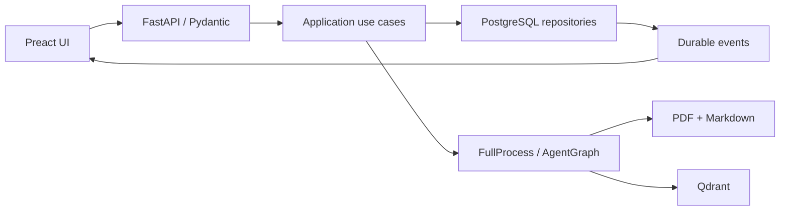

# Four-Stage Plan For The New Medic RAG UI/UX

> Status as of June 29, 2026: all four stages have been implemented, and the
> `/legacy` fallback was removed once the application fully moved to the
> Preact UI.

## Product Goal

The new interface carries a single operator through the whole process:

`upload → process → inspect → search/ask → verify source`

The same person can manage documents and ask questions. So the main
navigation doesn't split an "operator" mode from an "agent user" mode.
Instead it offers six consistent workspaces: Overview, Documents, Pipeline,
Assistant, Retrieval, and Admin.

The interface uses progressive disclosure. The most important state and the
next action are visible immediately, while technical data — markdown,
chunks, Qdrant points, events, and traces — live in drawers, tabs, and
expandable inspectors.

## Target Architecture

### Frontend

- Preact 10, TypeScript, Vite 8, and CSS Modules.
- No global store. Server data is fetched by specialized components and the
  `frontend/shared/api/client.ts` client.
- Documents filters, the open document, tab, and chunk are all persisted in
  the URL.
- API types are generated from OpenAPI into
  `frontend/shared/api/schema.d.ts`.
- Jinja renders only the application's entry point and uses the Vite
  manifest to load hashed assets.

### Backend

- Presentation: FastAPI endpoints, Pydantic validation, HTTP and SSE.
- Application: pipeline and asynchronous agent-run use cases.
- Infrastructure: SQLAlchemy repositories, the background executor, Qdrant,
  and the filesystem.
- Domain/core: agent and RAG models with no dependency on FastAPI, Pydantic,
  or SQLAlchemy.
- User operations are scoped by `owner_user_id`.

### Data Flow

## Stage 1 — Technical Foundation And Design System

### Scope

- Create the Preact application under `frontend/`.
- App shell with responsive navigation and deep-linkable routes.
- Design tokens for color, spacing, typography, radii, breakpoints, and
  shadows.
- Button, IconButton, StatusBadge, Alert, Toast, Dialog, Drawer, Tabs,
  EmptyState, LoadingState, ErrorState, and Skeleton components.
- Focus trap in modals, Escape handling, arrow-key navigation in Tabs,
  `focus-visible`, WCAG AA, and `prefers-reduced-motion`.
- `AssetManifest` and a Vite build into `dashboard/static/dist`.
- Node.js 24 in the build image, with a separate frontend watcher in
  Compose.
- Removal of the old dashboard once feature parity with the Preact UI was
  reached.

### Overview View

- PostgreSQL and Qdrant health state.
- Document, markdown, and index-point counts.
- The Upload → Prepare → Index → Ask → Verify workflow.
- The latest pipeline run and the latest conversation.
- Direct actions into Documents, Pipeline, and Assistant.

### Acceptance Criteria

- `/`, `/overview`, `/documents`, `/pipeline`, `/assistant`, and `/retrieval`
  all work on direct navigation.
- Login, logout, and `/admin` remain functional.
- `make dev` starts both the Python and frontend watchers.
- The runtime image contains only built, hashed assets.

## Stage 2 — Documents And Retrieval

### Contracts

- `GET /api/documents` supports pagination, query, status, sort, and
  direction.
- The default page size is 25, the maximum is 100.
- Document details are addressed by UUID:
  - `GET /api/documents/{document_id}`
  - `GET /api/documents/{document_id}/markdown`
  - `GET /api/documents/{document_id}/chunks`
  - `GET /api/documents/{document_id}/index-points`
- Technical tabs load independently. Opening Markdown/Chunks doesn't trigger
  a Qdrant points query.
- `POST /api/search` accepts a typed `query` and `limit`, and returns
  timing, ranking, and source metadata.

### Documents UX

- A drop zone and a per-file results queue.
- A desktop table and mobile cards.
- Filters and the inspector position live in the URL.
- A sticky selection bar with Run pipeline, Delete, and Clear.
- A drawer with Overview, Markdown, Chunks, and Index points.
- A link from retrieval or a citation opens the exact chunk and highlights
  it.
- The delete dialog explicitly shows the impact on the PDF, markdown,
  PostgreSQL, and Qdrant.

### Retrieval UX

- Query and limit.
- A ranking with score, document, chunk index, character range, point ID,
  hash, and excerpt.
- Separate messages for an empty index, no results, an unavailable Qdrant,
  and a request error.

### Acceptance Criteria

- The document list doesn't fetch the entire manifest and scales to at
  least 1000 records.
- The 390px viewport has no horizontal overflow.
- Upload → inspect → retrieval works in the Preact UI.

## Stage 3 — Durable And Transparent Pipeline

### Model And Boundaries

- Migration `0006_pipeline_runs` adds:
  - `pipeline_runs`
  - `pipeline_run_documents`
  - `pipeline_run_events`
- A run records the owner, status, timestamps, summary, and error.
- A run document keeps the UUID plus a snapshot of the name and path.
- An event has an increasing sequence, step, status, message, counters, and
  a result JSON.
- The application layer includes:
  - `StartPipelineRunUseCase`
  - `ListPipelineRunsUseCase`
  - `GetPipelineRunUseCase`
  - `StreamPipelineEventsUseCase`
- The repository and executor are ports. `FullProcess` remains the RAG
  executor.

### Runtime And SSE

- Only one global pipeline can run at a time.
- Active runs are marked `interrupted` after a restart.
- SSE replays events stored in PostgreSQL, respects `Last-Event-ID`, and
  ends with a `done` event.
- The frontend deduplicates events by sequence and lets the native
  EventSource reconnect automatically.

### Pipeline UX

- Six stages, a progress percentage, the current document, and the latest
  counters.
- A filterable timeline with expandable result JSON.
- A per-document result.
- Run history persists across restarts.
- Explicit queued, running, succeeded, failed, and interrupted states.

### Acceptance Criteria

- A restart doesn't erase history.
- Replaying from a specific sequence doesn't duplicate events.
- An error carries the step, the message, and a durable record in history.

## Stage 4 — Assistant Live Trace, Accessibility, And Finalization

### Agent Backend

- `AgentTraceRecorder` publishes every event to the `AgentTraceSink` port.
- SQLAlchemy incrementally persists events to `chat_trace_events`.
- Run finalization is an idempotent backfill of any missing events.
- The agent runs outside the HTTP request.
- A single conversation can have one active run.
- A run gets `interrupted` after a restart.
- Endpoints:
  - `POST /api/chat/runs`
  - `GET /api/chat/runs/{run_id}`
  - `GET /api/chat/runs/{run_id}/events`

### Assistant UX

- Desktop: a conversation list, chat, and a Source Inspector drawer.
- Mobile: a single column and a full-screen drawer.
- Enter sends, Shift+Enter adds a line.
- The live timeline shows the coordinator, specialist, retrieval, review,
  synthesis, and error phases.
- A saved answer's trace is collapsed by default.
- A citation opens full metadata and jumps to the exact chunk.
- A failed run restores the question and offers a retry.

### Quality Finalization

- Vitest and Testing Library cover the shell, Tabs, dialogs, and UI states.
- Playwright and axe run the same scenario at 1440, 1024, and 390px.
- Checked: keyboard-only navigation, contrast, dialogs, drawers, tabs, chat,
  citations, and no horizontal overflow.
- `make verify` runs TypeScript typechecking, frontend tests, the Vite
  build, Ruff, strict mypy, and pytest.

### Final E2E Scenario

1. Upload three demo PDFs.
2. Select documents.
3. Run the pipeline with live events.
4. Inspect markdown, chunks, and index points.
5. Run a retrieval search.
6. Ask the agent a question with a live trace.
7. Open a citation and its source chunk.
8. Restart, and confirm pipeline and conversation history survived.

## Rollout And Rollback Strategy

- Each stage keeps existing APIs, or adds new endpoints.
- Rolling back the frontend means restoring the previous runtime image.
- The database migration is additive; downgrading only drops the new tables
  and restores the previous chat-run status constraint.
- Assets ship atomically with the runtime image via the Vite manifest.
- Removal of the old vanilla JS/CSS dashboard happened only after the final
  E2E pass and confirmed feature parity.

## Implementation Verification Result

- `make verify`: passed.
- Python: 240 tests passed, 2 integration tests skipped.
- TypeScript: strict typecheck passed.
- Frontend: Vitest and the production Vite build passed.
- Docker: the runtime image was built and run as `medic:medic`.
- Image smoke test: migrations, healthcheck, login, direct `/documents`
  navigation, hashed CSS/JS, and the Overview, Pipeline, and Conversations
  views all returned correct responses.
- `npm audit --omit=dev`: zero runtime vulnerabilities.
- Two moderate vulnerabilities remain in the transitive YAML parser used by
  the `openapi-typescript` tool. That package only processes a local,
  application-generated OpenAPI file and isn't copied into the runtime
  image. The current `openapi-typescript` release doesn't yet ship a
  compatible fix.
- Playwright/axe: 6/6 tests passed at the 1440, 1024, and 390px viewports.
  Verified: no critical/serious axe violations, no horizontal overflow, and
  full keyboard access to the main navigation.
- The full scenario — three-PDF upload, live pipeline, live agent, and a
  restart — requires configured Qdrant/OpenRouter services.
