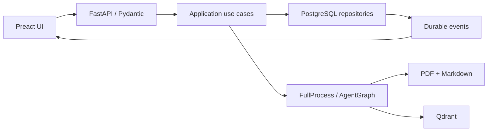

# Czteroetapowy plan wdrożenia nowego UI/UX Medic RAG

> Status na 29 czerwca 2026: wszystkie cztery etapy zostały zaimplementowane,
> a fallback `/legacy` został usunięty po przejściu aplikacji na Preact UI.

## Cel produktu

Nowy interfejs prowadzi jednego operatora przez cały proces:

`upload → process → inspect → search/ask → verify source`

Ta sama osoba może zarządzać dokumentami i zadawać pytania. Dlatego główna
nawigacja nie rozdziela trybu „operatora” i „użytkownika agenta”. Zamiast tego
udostępnia sześć spójnych przestrzeni: Overview, Documents, Pipeline,
Assistant, Retrieval i Admin.

Interfejs stosuje progressive disclosure. Najważniejszy stan i następna akcja
są widoczne od razu, natomiast dane techniczne — markdown, chunki, punkty
Qdrant, eventy i trace — są dostępne w drawerach, zakładkach i rozwijanych
inspectorach.

## Architektura docelowa

### Frontend

- Preact 10, TypeScript, Vite 8 i CSS Modules.
- Brak globalnego store. Dane serwera są pobierane przez wyspecjalizowane
  komponenty i klienta `frontend/shared/api/client.ts`.
- Filtry Documents oraz otwarty dokument, zakładka i chunk są przechowywane
  w URL.
- Typy API są generowane z OpenAPI do
  `frontend/shared/api/schema.d.ts`.
- Jinja renderuje wyłącznie punkt wejścia aplikacji i korzysta z manifestu
  Vite do ładowania hashowanych assetów.

### Backend

- Presentation: endpointy FastAPI, walidacja Pydantic, HTTP i SSE.
- Application: przypadki użycia pipeline i asynchronicznych runów agenta.
- Infrastructure: repozytoria SQLAlchemy, wykonawca w tle, Qdrant i filesystem.
- Domain/core: modele agentów i RAG bez zależności od FastAPI, Pydantic ani
  SQLAlchemy.
- Operacje użytkownika są ograniczane przez `owner_user_id`.

### Przepływ danych

## Etap 1 — Fundament techniczny i design system

### Zakres

- Utworzenie aplikacji Preact w katalogu `frontend/`.
- App shell z responsywną nawigacją i zachowaniem bezpośrednich adresów.
- Design tokens dla kolorów, spacingu, typografii, radiusów, breakpointów
  i cieni.
- Komponenty Button, IconButton, StatusBadge, Alert, Toast, Dialog, Drawer,
  Tabs, EmptyState, LoadingState, ErrorState i Skeleton.
- Focus trap w modalach, obsługa Escape, nawigacja strzałkami w Tabs,
  `focus-visible`, WCAG AA i `prefers-reduced-motion`.
- `AssetManifest` i build Vite do `dashboard/static/dist`.
- Node.js 24 w obrazie buildowym i osobny watcher frontendu w Compose.
- Usunięcie starego dashboardu po osiągnięciu parytetowości w Preact UI.

### Widok Overview

- Stan PostgreSQL i Qdrant.
- Liczba dokumentów, markdownów i punktów indeksu.
- Workflow Upload → Prepare → Index → Ask → Verify.
- Ostatni run pipeline i ostatnia rozmowa.
- Bezpośrednie akcje do Documents, Pipeline i Assistant.

### Kryterium odbioru

- `/`, `/overview`, `/documents`, `/pipeline`, `/assistant` i `/retrieval`
  działają po bezpośrednim wejściu.
- Login, logout i `/admin` pozostają funkcjonalne.
- `make dev` uruchamia watchery Python i frontend.
- Obraz runtime zawiera wyłącznie zbudowane, hashowane assety.

## Etap 2 — Documents i Retrieval

### Kontrakty

- `GET /api/documents` obsługuje pagination, query, status, sort i direction.
- Domyślny page size wynosi 25, maksymalny 100.
- Szczegóły dokumentu są adresowane UUID:
  - `GET /api/documents/{document_id}`
  - `GET /api/documents/{document_id}/markdown`
  - `GET /api/documents/{document_id}/chunks`
  - `GET /api/documents/{document_id}/index-points`
- Zakładki techniczne są ładowane niezależnie. Otworzenie Markdown/Chunks nie
  wykonuje zapytania o punkty Qdrant.
- `POST /api/search` przyjmuje typowane `query` i `limit`, a zwraca czas,
  ranking oraz metadane źródła.

### UX Documents

- Drop zone i kolejka wyników per plik.
- Tabela desktopowa i karty mobilne.
- Filtry oraz pozycja inspectora w URL.
- Sticky selection bar z Run pipeline, Delete i Clear.
- Drawer z Overview, Markdown, Chunks i Index points.
- Link z retrieval lub cytowania otwiera dokładny chunk i wyróżnia go.
- Dialog usuwania jawnie pokazuje wpływ na PDF, markdown, PostgreSQL i Qdrant.

### UX Retrieval

- Query i limit.
- Ranking z score, dokumentem, chunk index, zakresem znaków, point ID, hashem
  i excerptem.
- Oddzielne komunikaty dla pustego indeksu, braku wyników, niedostępnego
  Qdrant i błędu requestu.

### Kryterium odbioru

- Lista dokumentów nie pobiera całego manifestu i skaluje się do co najmniej
  1000 rekordów.
- Widok 390 px nie ma poziomego overflow.
- Upload → inspect → retrieval działa w Preact UI.

## Etap 3 — Trwały i transparentny Pipeline

### Model i granice

- Migracja `0006_pipeline_runs` dodaje:
  - `pipeline_runs`
  - `pipeline_run_documents`
  - `pipeline_run_events`
- Run zapisuje ownera, status, timestamps, summary i error.
- Dokument runu zachowuje UUID oraz snapshot nazwy i ścieżki.
- Event ma rosnący sequence, step, status, message, counters i result JSON.
- Application zawiera:
  - `StartPipelineRunUseCase`
  - `ListPipelineRunsUseCase`
  - `GetPipelineRunUseCase`
  - `StreamPipelineEventsUseCase`
- Repozytorium i wykonawca są portami. `FullProcess` pozostaje wykonawcą RAG.

### Runtime i SSE

- W danej chwili może działać jeden globalny pipeline.
- Aktywne runy po restarcie są oznaczane jako `interrupted`.
- SSE odtwarza eventy zapisane w PostgreSQL, respektuje `Last-Event-ID`
  i kończy się eventem `done`.
- Frontend deduplikuje eventy po sequence i pozwala natywnemu EventSource
  automatycznie wznowić połączenie.

### UX Pipeline

- Sześć etapów, procent postępu, aktualny dokument i ostatnie liczniki.
- Filtrowalny timeline z rozwijanymi result JSON.
- Wynik każdego dokumentu.
- Historia runów trwała po restarcie.
- Jawne stany queued, running, succeeded, failed i interrupted.

### Kryterium odbioru

- Restart nie usuwa historii.
- Replay od konkretnego sequence nie duplikuje eventów.
- Błąd zawiera etap, komunikat i trwały zapis w historii.

## Etap 4 — Assistant live trace, dostępność i finalizacja

### Backend agenta

- `AgentTraceRecorder` publikuje każdy event do portu `AgentTraceSink`.
- SQLAlchemy zapisuje eventy inkrementalnie do `chat_trace_events`.
- Finalizacja runu jest idempotentnym backfillem brakujących eventów.
- Agent wykonuje się poza requestem HTTP.
- Jedna rozmowa może mieć jeden aktywny run.
- Run po restarcie otrzymuje `interrupted`.
- Endpointy:
  - `POST /api/chat/runs`
  - `GET /api/chat/runs/{run_id}`
  - `GET /api/chat/runs/{run_id}/events`

### UX Assistant

- Desktop: lista rozmów, chat i drawer Source Inspector.
- Mobile: jedna kolumna i pełnoekranowy drawer.
- Enter wysyła, Shift+Enter dodaje linię.
- Live timeline pokazuje fazy coordinator, specialist, retrieval, review,
  synthesis i error.
- Trace zapisanej odpowiedzi jest domyślnie zwinięty.
- Cytowanie otwiera pełne metadane i prowadzi do konkretnego chunku.
- Błąd runu przywraca pytanie i udostępnia retry.

### Finalizacja jakości

- Vitest i Testing Library pokrywają shell, Tabs, dialog i stany UI.
- Playwright i axe uruchamiają ten sam scenariusz dla 1440, 1024 i 390 px.
- Sprawdzane są: keyboard-only, kontrast, dialogi, drawers, tabs, chat,
  citations i brak poziomego overflow.
- `make verify` wykonuje typowanie TypeScript, testy frontendu, build Vite,
  Ruff, strict mypy i pytest.

### Końcowy scenariusz E2E

1. Upload trzech demo PDF.
2. Zaznaczenie dokumentów.
3. Pipeline z live eventami.
4. Inspekcja markdown, chunks i index points.
5. Retrieval search.
6. Pytanie do agenta z live trace.
7. Otwarcie cytowania i źródłowego chunku.
8. Restart i potwierdzenie historii pipeline oraz rozmów.

## Strategia wdrożenia i rollback

- Każdy etap zachowuje istniejące API lub dodaje nowe endpointy.
- Rollback frontendu wymaga przywrócenia poprzedniej wersji obrazu runtime.
- Migracja bazy jest addytywna; downgrade usuwa wyłącznie nowe tabele i
  przywraca poprzedni constraint statusu chat run.
- Assety są atomowo dostarczane z obrazem runtime przez manifest Vite.
- Usunięcie starego vanilla JS/CSS następuje dopiero po przejściu końcowego
  E2E i potwierdzeniu parytetu funkcji.

## Wynik weryfikacji implementacji

- `make verify`: zakończone poprawnie.
- Python: 240 testów zakończonych poprawnie, 2 testy integracyjne pominięte.
- TypeScript: strict typecheck zakończony poprawnie.
- Frontend: Vitest i produkcyjny build Vite zakończone poprawnie.
- Docker: obraz runtime zbudowany i uruchomiony jako `medic:medic`.
- Smoke test obrazu: migracje, healthcheck, login, bezpośredni `/documents`,
  hashowane CSS/JS, Overview, Pipeline i Conversations zwróciły poprawne
  odpowiedzi.
- `npm audit --omit=dev`: zero podatności runtime.
- Dwie umiarkowane podatności pozostają w transytywnym parserze YAML narzędzia
  `openapi-typescript`. Pakiet przetwarza lokalny, generowany przez aplikację
  plik OpenAPI i nie jest kopiowany do obrazu runtime. Aktualna wersja
  `openapi-typescript` nie udostępnia jeszcze kompatybilnej poprawki.
- Playwright/axe: 6/6 testów zakończonych poprawnie dla viewportów 1440, 1024
  i 390 px. Zweryfikowano brak krytycznych/poważnych naruszeń axe, brak
  poziomego overflow oraz dostępność głównej nawigacji z klawiatury.
- Pełny scenariusz z uploadem trzech PDF, live pipeline, live agentem i
  restartem wymaga skonfigurowanych usług Qdrant/OpenRouter.
